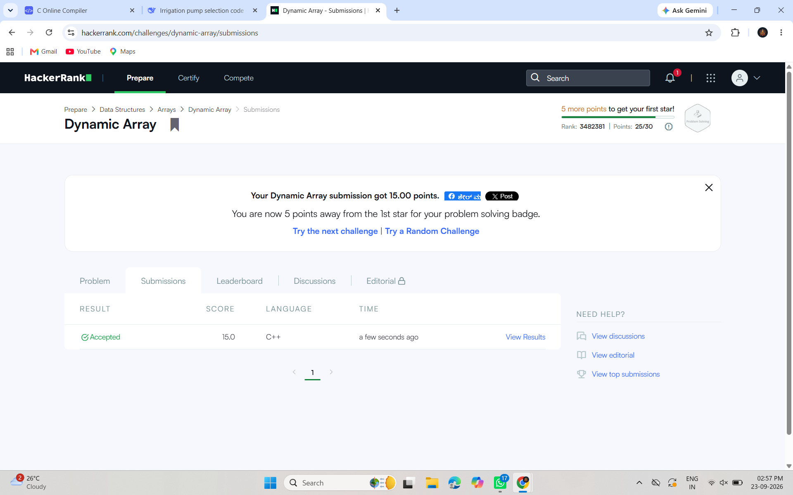
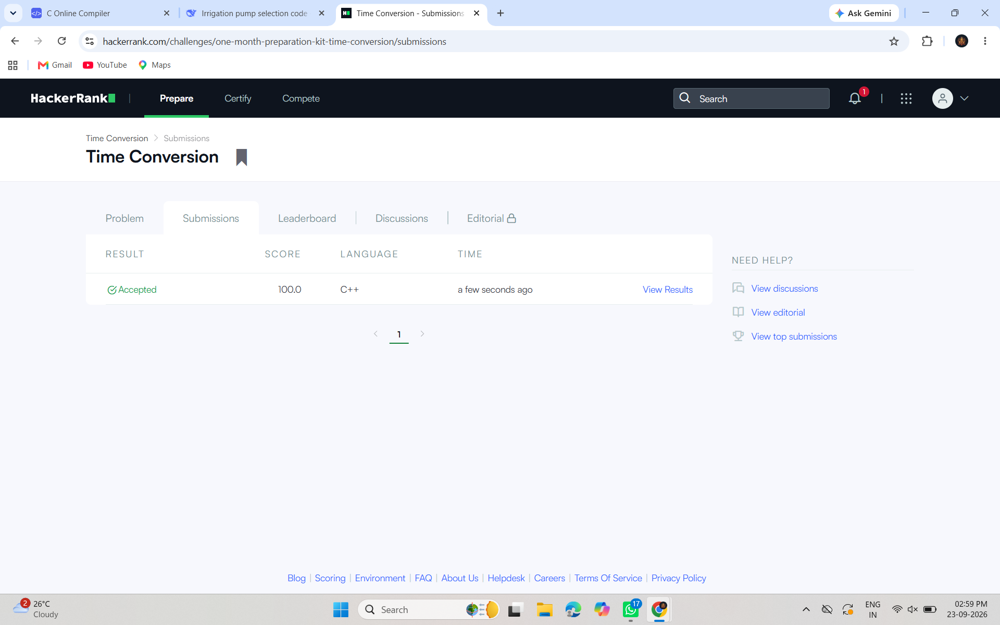
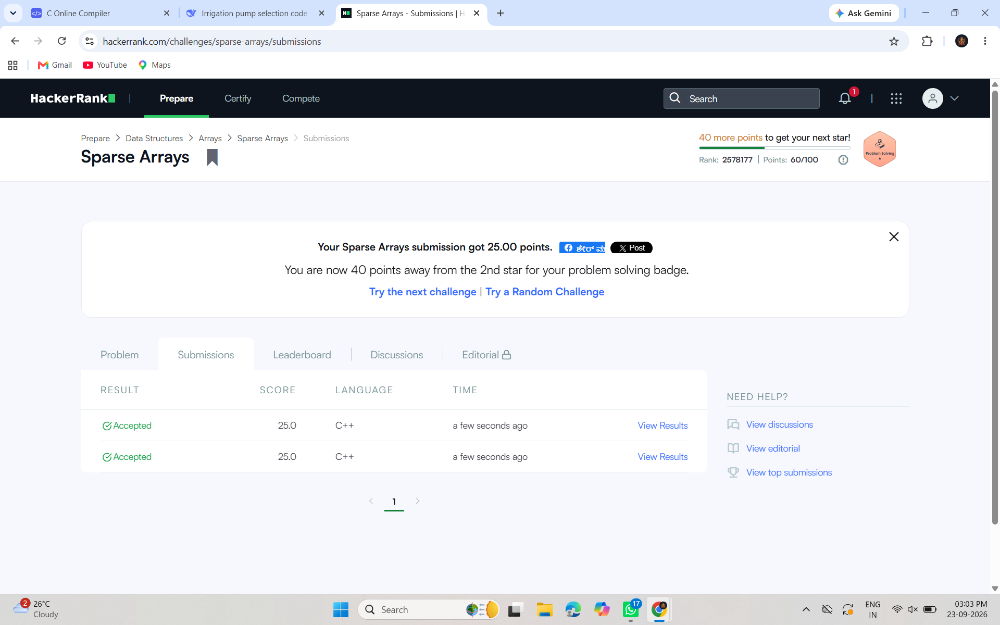

 # HackerRank 3rd Semester Portfolio

## Student Information
- **Name:** Pallavi P N
- **Roll No:** R25EJ096
- **Program:** B.Tech Computer Science and Engineering
- **Semester:** 3rd Semester
- **Course:** Portfolio Building
- **Activity:** Activity 8 — HackerRank Algorithmic Problem-Solving

## HackerRank Profile
[View my HackerRank Profile](https://www.hackerrank.com/PALLAVI1300)

## Problem Set & Complexity Analysis

| # | Problem | Topic | Time Complexity | Space Complexity |
|---|---------|-------|-----------------|------------------|
| 1 | Diagonal Difference | 2D Arrays / Matrices | O(N) | O(1) |
| 2 | Dynamic Array | Data Structures / Vectors | O(N + Q) | O(N) |
| 3 | Time Conversion | Strings & Logic | O(1) | O(1) |
| 4 | Compare the Triplets | Basic Implementation | O(1) | O(1) |
| 5 | Sparse Arrays | Hash Maps / Strings | O(N + Q) | O(N) |

## Solutions

### 1. Diagonal Difference
- **Description:** Find the absolute difference between the sums of the primary and secondary diagonals of a square matrix.
- **Approach:** Traverse the matrix once, summing both diagonals simultaneously.
- **Complexity:** Time O(N), Space O(1)
- **Status:** Accepted

### 2. Dynamic Array
- **Description:** Manipulate a 2D nested sequence using bitwise XOR operations.
- **Approach:** Use a vector of vectors and track the last answer.
- **Complexity:** Time O(N + Q), Space O(N)
- **Status:** Accepted

### 3. Time Conversion
- **Description:** Convert 12-hour AM/PM time to 24-hour military format.
- **Approach:** Parse hour and period, adjust accordingly.
- **Complexity:** Time O(1), Space O(1)
- **Status:** Accepted

### 4. Compare the Triplets
- **Description:** Compare two triplets element-wise and track scores.
- **Approach:** Simple iteration with conditional checks.
- **Complexity:** Time O(1), Space O(1)
- **Status:** Accepted

### 5. Sparse Arrays
- **Description:** Find frequency of query strings in a list of strings.
- **Approach:** Use an unordered_map for O(1) frequency lookup.
- **Complexity:** Time O(N + Q), Space O(N)
- **Status:** Accepted

## HackerRank Badge

## Reflection

Through this activity, I learned how to approach algorithmic problems by first understanding the input, output, constraints, and required operations. The five HackerRank problems helped me practice arrays, matrices, strings, vectors, hash maps, and basic logical operations. I learned that choosing an appropriate data structure can significantly improve program efficiency. For example, using a frequency map for Sparse Arrays avoids repeatedly scanning the entire list for every query. I also understood the importance of analyzing time and space complexity before submitting a solution. Problems such as Diagonal Difference showed how a single traversal can calculate both diagonal sums using constant extra space. Dynamic Array helped me understand vectors, XOR operations, and indexed sequence storage. Time Conversion strengthened my string manipulation and conditional logic skills, while Compare the Triplets reinforced simple iteration and score tracking. Solving these problems on HackerRank also helped me verify my implementations against multiple test cases. Uploading the solutions to GitHub improved my understanding of organizing source code and documenting technical work. Overall, this activity improved my problem-solving approach and taught me to focus not only on obtaining the correct output but also on writing efficient, readable, and well-documented solutions.
